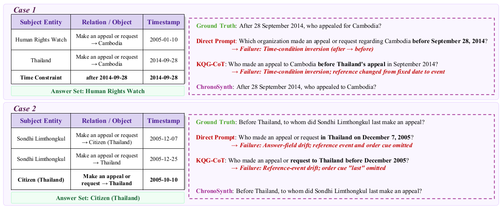
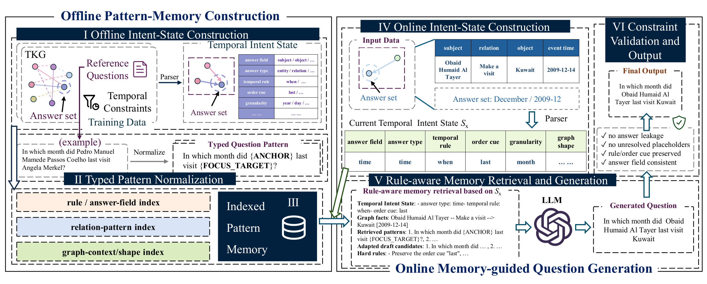

<div align="center">

# ⏳ ChronoSynth

### Constraint-Aware Question Synthesis over Temporal Knowledge Graphs

**Feng Liang<sup>1</sup>, Weixin Zeng<sup>1</sup>, Runhao Zhao<sup>1</sup>, Mingjun Zhou<sup>1</sup>, Shaoshi Yang<sup>2</sup>, Xiang Zhao<sup>1,*</sup>**

<sup>1</sup> National University of Defense Technology &nbsp;&nbsp; <sup>2</sup> Beijing University of Posts and Telecommunications<br>
<sup>*</sup> Corresponding author

[](https://fungloeng.github.io/ChronoSynth/)
[](PAPER_TRACEABILITY.md)
[](requirements.txt)
[](DATASETS.md)

Official implementation and paper-aligned supplementary artifact.

[**Project page**](https://fungloeng.github.io/ChronoSynth/) · [**Reproduce experiments**](REPRODUCIBILITY.md) · [**Prepare datasets**](DATASETS.md) · [**Trace paper results**](PAPER_TRACEABILITY.md)

</div>

<p align="center">
  
</p>

## Overview

Temporal knowledge graph question generation is a constraint-preservation problem. A fluent question can still be incorrect when it reverses a temporal operator, drops a first/last condition, changes the reference event, or asks for the wrong answer field.

ChronoSynth addresses these failures with three components:

1. **Temporal Intent State** makes the answer field, temporal rule, reference point, graph shape, and time granularity explicit before generation.
2. **Indexed pattern memory** retrieves typed question patterns by temporal compatibility before relation and topology similarity.
3. **Constraint-aware realization** adapts patterns to the input graph and validates answer leakage, unresolved placeholders, temporal mismatch, and answer-field drift.

<p align="center">
  
</p>

## Highlights

- **Constraint-aware generation:** temporal intent is represented explicitly instead of being inferred only from a linearized graph prompt.
- **Reusable indexed memory:** typed patterns can be cached and shared across generation runs without updating model parameters.
- **Backend robustness:** the paper evaluates ChronoSynth with Qwen3.5-9B, DeepSeek-V4-Flash, and GPT-4o-mini.
- **Inspectable artifact:** every reported aggregate is mapped to its generating code and frozen result file.

## Main Results

Full-test ChronoSynth results reported in the final manuscript:

| Dataset | Backend | BLEU-4 | ROUGE-L | CIDEr |
|:--|:--|--:|--:|--:|
| CRONQUESTIONS | Qwen3.5-9B | 0.2959 | 0.5054 | 2.7439 |
| CRONQUESTIONS | DeepSeek-V4-Flash | **0.2970** | 0.4997 | 2.7196 |
| CRONQUESTIONS | GPT-4o-mini | 0.2947 | **0.5054** | **2.7451** |
| MultiTQ | Qwen3.5-9B | 0.3109 | 0.5271 | 2.6455 |
| MultiTQ | DeepSeek-V4-Flash | **0.3128** | **0.5299** | **2.7134** |
| MultiTQ | GPT-4o-mini | 0.3038 | 0.5231 | 2.6135 |

On MultiTQ, ChronoSynth improves BLEU-4 by up to **53.3%** and CIDEr by up to **66.0%** over the strongest prompting-only baseline. Exact table provenance, ablations, grouped analyses, temporal-faithfulness audits, and efficiency results are recorded in [`paper_results/`](paper_results/) and [`PAPER_TRACEABILITY.md`](PAPER_TRACEABILITY.md).

## Getting Started

### 1. Install

```bash
git clone https://github.com/fungloeng/ChronoSynth.git
cd ChronoSynth

python -m venv .venv
source .venv/bin/activate
pip install -r requirements.txt
```

### 2. Configure an OpenAI-compatible endpoint

```bash
export A_API_KEY="your-api-key"
export A_BASE_URL="https://your-endpoint.example/v1"
```

### 3. Prepare benchmark data

Datasets are not redistributed in this artifact. Obtain the official CRONQUESTIONS and MultiTQ releases, then follow [`DATASETS.md`](DATASETS.md) to create:

```text
data/
├── CRONQUESTION/
│   ├── train.json
│   ├── valid.json
│   └── test.json
└── MULTITQ/
    ├── train.json
    ├── valid.json
    └── test.json
```

### 4. Run ChronoSynth

```bash
PYTHONPATH=chronosynth python experiments/run_chrono_experiment.py \
  --train data/CRONQUESTION/train.json \
  --input data/CRONQUESTION/test.json \
  --output result/chrono_full_CRONQUESTION_test.json \
  --model gpt-4o-mini \
  --workers 30 \
  --memory_bank_cache result/cache/cronquestion.pkl \
  --ablation full
```

Evaluate the generated questions:

```bash
python evaluate.py result/chrono_full_CRONQUESTION_test.json \
  --out result/chrono_full_CRONQUESTION_test.metrics.json
```

## Reproducing the Paper

| Study | Entry point | Output or frozen record |
|:--|:--|:--|
| RQ1: full-test quality | `experiments/run_chrono_experiment.py` | `paper_results/final_main_table_fulltest.csv` |
| RQ2: component ablation | `--ablation full/no_memory/relation_only` | `paper_results/component_ablation_summary.md` |
| RQ3: grouped robustness | `experiments/analyze_grouped_results.py` | `paper_results/grouped_significance_test.csv` |
| Temporal faithfulness | `run_chrono_temporal_judge.py` | `paper_results/temporal_faithfulness_table.csv` |
| RQ4: variance and cache | `experiments/summarize_variance_cache.py` | `paper_results/*variance*`, `*cache*` |
| RQ5: memory scale | `experiments/summarize_scalability.py` | `paper_results/scalability_multitq_summary.csv` |
| Static KGQG sanity check | `run_full_chrono_kgqg.py` | `paper_results/paper_values.json` |

The complete commands and experimental conditions are in [`REPRODUCIBILITY.md`](REPRODUCIBILITY.md). Frozen aggregates are provided because remote model outputs can vary with provider updates and decoding nondeterminism.

## Repository Layout

```text
ChronoSynth/
├── chronosynth/chronoagent_harness/   # Core ChronoSynth implementation
├── experiments/                       # Paper experiment and analysis scripts
├── scripts/                           # Static KGQG data preparation
├── paper_results/                     # Frozen aggregate manuscript results
├── docs/                              # GitHub Pages project site
├── run_full_chrono.py                 # Temporal benchmark runner
├── run_full_chrono_kgqg.py            # Static KGQG sanity-check runner
├── run_chrono_temporal_judge.py       # Temporal-faithfulness audit
├── evaluate.py                        # Generation metric evaluation
├── DATASETS.md                        # Dataset schema and preparation
├── REPRODUCIBILITY.md                 # Commands for all paper studies
└── PAPER_TRACEABILITY.md              # Claim-to-code/result provenance
```

## Artifact Scope

This repository contains the ChronoSynth method, paper-used experiment code, aggregate results, dataset preparation instructions, and the project website. It intentionally excludes:

- benchmark dataset records;
- baseline implementations;
- model weights and checkpoints;
- raw prediction dumps and caches;
- API keys and private server paths.

See [`artifact_manifest.json`](artifact_manifest.json) for the machine-readable artifact declaration.

## Acknowledgement

The experiments use the official CRONQUESTIONS and MultiTQ benchmarks. Please cite their original publications when using those datasets.
